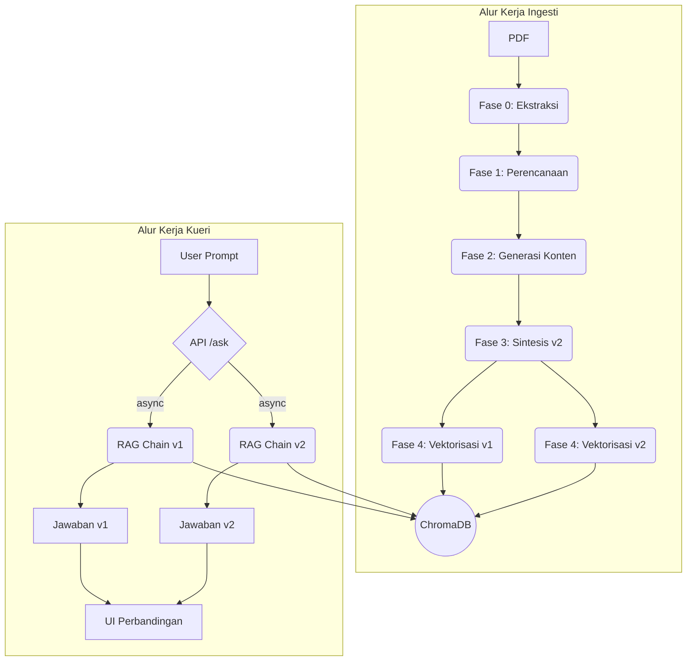

# Genesis-RAG: Advanced RAG with Automated Document Enrichment
Sebuah sistem end-to-end yang mendemonstrasikan pipeline RAG canggih dengan fase enrichment dokumen otomatis untuk memberikan jawaban yang lebih kaya konteks. Proyek ini dibangun dengan arsitektur modular dan praktik terbaik rekayasa perangkat lunak.

## Masalah & Solusi
Sistem RAG standar seringkali gagal menjawab pertanyaan yang membutuhkan pemahaman implisit atau pengetahuan domain yang tidak tertulis secara eksplisit dalam teks. Genesis-RAG mengatasi ini dengan pipeline ingesti multi-tahap yang secara proaktif memperkaya (enrich) dokumen. Hasilnya adalah knowledge base yang superior, memungkinkan jawaban yang lebih akurat dan komprehensif dibandingkan dengan RAG naif.

## Tumpukan Teknologi
| Kategori | Teknologi |
| :--- | :--- |
| Backend | Python, FastAPI |
| Orkestrasi AI | LangChain |
| Model AI | Google Gemini (Embeddings & Generative) |
| Database Vektor | ChromaDB (Client-Server Mode) |
| Pemrosesan Dokumen | PyMuPDF |
| Frontend | Vanilla JavaScript, HTML5, CSS3 |
| Logging | Loguru |

## Arsitektur Alur Kerja
Aplikasi ini terdiri dari dua alur kerja utama: Ingesti Dokumen dan Kueri RAG.



## Pengembangan Lokal (Local Development)

### 1. Prasyarat
- Python 3.9+
- Git

### 2. Instalasi
```bash
# 1. Kloning repositori
git clone <URL_REPOSITORI_ANDA>
cd Genesis-RAG

# 2. Buat dan aktifkan virtual environment
python -m venv venv
# Windows:
# .\venv\Scripts\activate
# macOS/Linux:
# source venv/bin/activate

# 3. Instal semua dependensi
pip install -r requirements.txt

# 4. Siapkan environment variables
cp .env_example .env
# Edit file .env dan masukkan Google API Key Anda
```

Contoh `.env` minimal:

```ini
GOOGLE_API_KEY=your_google_api_key_here

# Mode ChromaDB (default: server)
CHROMA_MODE=server
CHROMA_SERVER_HOST=localhost
CHROMA_SERVER_PORT=8001
# Jika menggunakan embedded mode (opsional):
# CHROMA_MODE=embedded
# CHROMA_DB_PATH=chroma_db
```

### 3. Menjalankan Aplikasi
Proyek ini menggunakan arsitektur Klien-Server. Anda perlu menjalankan dua proses di dua terminal terpisah: Server Database (ChromaDB) dan Server Aplikasi (FastAPI).

**Terminal 1: Jalankan Server ChromaDB**
Terminal ini didedikasikan untuk mengelola database vektor (Cukup jalankan satu kali saja).

```bash
# Dari direktori root proyek, jalankan perintah berikut:
chroma run --path chroma_db --port 8001
```
Biarkan terminal ini tetap berjalan di latar belakang.

**Terminal 2: Jalankan Server Aplikasi FastAPI**
Terminal ini untuk menjalankan logika utama dan API aplikasi.

```bash
# Pastikan virtual environment Anda sudah aktif
# Dari direktori root proyek, jalankan perintah berikut:
python -m uvicorn src.main:app --host 0.0.0.0 --port 8000 --reload
```
Server aplikasi sekarang akan berjalan dan terhubung ke server ChromaDB.

### 4. Buka Aplikasi di Browser
Buka browser dan akses alamat `http://127.0.0.1:8000`.

## Alur Penggunaan UI

1) **Unggah** PDF pada panel kiri untuk menghasilkan `markdown_v1.md` (Fase 0).

2) **Tingkatkan**: Klik tombol "Mulai Enhancement" untuk menjalankan Fase 1 (Perencanaan) dan Fase 2 (Generasi). Status akan menampilkan "Berjalan..." hingga saran siap.

3) **Kurasi**: Pada panel Saran, tinjau setiap kartu. Anda dapat:
   - Setujui/Tolak saran.
   - Edit teks saran sebelum finalisasi.
   - Gunakan tombol "Setujui Semua" / "Tolak Semua" sebagai aksi massal.

4) **Finalisasi**: Klik "Finalisasi Dokumen" untuk menyintesis `markdown_v2.md` (Fase 3) dan melakukan vektorisasi v1 & v2 ke ChromaDB (Fase 4). Stepper akan berpindah ke fase Tanya Jawab.

5) **Tanya Jawab**: Ajukan pertanyaan dan bandingkan jawaban dari v1 (asli) dan v2 (diperkaya).

## Konfigurasi
Pengaturan utama proyek, seperti nama model, path, dan template prompt, dikelola secara terpusat di `src/core/config.py` untuk kemudahan modifikasi.

## API Endpoints

### `POST /upload-document/`
Unggah PDF dan jalankan Fase 0 (ekstraksi) saja.
- Request: `multipart/form-data` dengan field `file`
- Response 201 (UploadResponse):
  ```json
  {
    "document_id": "uuid",
    "markdown_content": "...markdown_v1.md..."
  }
  ```

### `POST /start-enhancement/{document_id}`
Menjalankan tugas latar belakang untuk Fase 1 (perencanaan) dan Fase 2 (generasi). Kembalikan segera dan lanjutkan via polling.
- Response 200:
  ```json
  { "message": "Proses peningkatan dimulai", "document_id": "uuid" }
  ```

### `GET /get-suggestions/{document_id}`
Polling daftar saran hasil Fase 2.
- Response 200 (EnhancementResponse):
  ```json
  { "document_id": "uuid", "suggestions": [ /* SuggestionItem[] */ ] }
  ```
  Catatan: Jika `suggestions.json` belum tersedia, endpoint mengembalikan `suggestions: []`.

### `POST /finalize-document/`
Terima saran terkurasi, sintesis `markdown_v2.md` dan vektorisasi v1 & v2 ke ChromaDB.
- Request (CuratedSuggestions):
  ```json
  {
    "document_id": "uuid",
    "suggestions": [ {"id":"term_0","type":"term_to_define","original_context":"...","generated_content":"...","confidence_score":0.9,"status":"approved"} ]
  }
  ```
- Response 200:
  ```json
  { "message": "Dokumen difinalisasi dan divektorisasi.", "document_id": "uuid" }
  ```

### `POST /ask/`
Ajukan pertanyaan terhadap versi v1, v2, atau keduanya dari dokumen.
- Request:
  ```json
  { "document_id": "uuid", "prompt": "Pertanyaan Anda", "version": "both" }
  ```
- Response 200 (jika `version` = `both`):
  ```json
  {
    "unenriched_answer": "jawaban dari v1",
    "enriched_answer": "jawaban dari v2",
    "prompt": "Pertanyaan Anda"
  }
  ```
  Response 200 (jika `version` = `v1` atau `v2`):
  ```json
  { "answer": "jawaban", "version": "v1", "prompt": "Pertanyaan Anda" }
  ```

## Troubleshooting

- **GOOGLE_API_KEY tidak diset**: Pastikan `.env` berisi `GOOGLE_API_KEY` yang valid.
- **Tidak bisa konek ke ChromaDB (server)**: Jalankan `chroma run --path chroma_db --port 8001` terlebih dahulu atau ubah `CHROMA_MODE=embedded`.
- **Polling saran terlalu lama**: Dokumen besar atau kuota API. Tunggu atau coba ulang. Log akan menampilkan status Fase 1/2.
- **Saran kosong**: Sistem memiliki fallback dan akan tetap membuat file rencana minimal; pastikan log Fase 1/2 tidak berisi error.