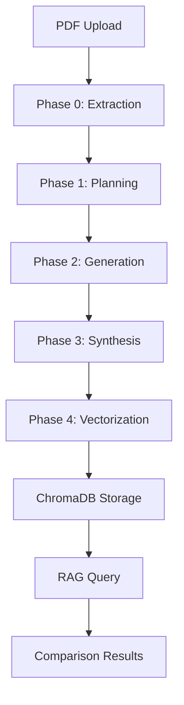

# Genesis-RAG v3.0

A high-fidelity document enrichment and comparison engine, refactored for production readiness and improved maintainability.

## 🚀 Features

- **Document Processing Pipeline**: Multi-phase enrichment of PDF documents
- **RAG (Retrieval-Augmented Generation)**: Compare original vs enriched document versions
- **Vector Storage**: ChromaDB for efficient semantic search
- **AI Integration**: Google Gemini API for content generation and embeddings
- **RESTful API**: FastAPI backend with comprehensive endpoints
- **Modern Frontend**: Clean, responsive web interface

## 📁 Project Structure

```
Genesis-RAG/
├── src/
│   ├── api/
│   │   └── endpoints.py          # REST API endpoints
│   ├── core/
│   │   ├── config.py            # Centralized configuration
│   │   └── logging_config.py    # Logging setup
│   ├── pipeline/
│   │   ├── phase_0_extraction.py    # PDF → Markdown
│   │   ├── phase_1_planning.py      # Enrichment plan
│   │   ├── phase_2_generation.py    # Content generation
│   │   ├── phase_3_synthesis.py     # Final markdown
│   │   └── phase_4_vectorization.py # Vector storage
│   └── main.py                  # FastAPI application
├── static/
│   ├── script.js               # Frontend JavaScript
│   └── style.css               # Frontend styling
├── index.html                  # Main web interface
├── requirements.txt            # Python dependencies
├── .env                        # Environment variables (create from .env_example)
└── README.md                   # This file
```

## 🏗️ Architecture



## 🛠️ Installation

### Prerequisites
- Python 3.8+
- Google Gemini API key

### 1. Clone Repository
```bash
git clone [repository-url]
cd Genesis-RAG
```

### 2. Setup Environment
```bash
# Create virtual environment
python -m venv venv
source venv/bin/activate  # On Windows: venv\Scripts\activate

# Install dependencies
pip install -r requirements.txt
```

### 3. Configure Environment Variables
```bash
# Copy example file
cp .env_example .env

# Edit .env with your API key
GOOGLE_API_KEY=your_google_api_key_here
```

### 4. Start Services

#### Terminal 1: Start ChromaDB Server
```bash
chroma run --path chroma_db --port 8001
```

#### Terminal 2: Start FastAPI Application
```bash
uvicorn src.main:app --reload
```

## 🎯 Usage

### Web Interface
1. Open `http://localhost:8000` in your browser
2. Upload a PDF document
3. Wait for processing to complete
4. Enter questions to compare original vs enriched versions

### API Endpoints

#### Upload Document
```bash
curl -X POST "http://localhost:8000/upload-document/" \
  -H "Content-Type: multipart/form-data" \
  -F "file=@your_document.pdf"
```

#### Ask Question
```bash
curl -X POST "http://localhost:8000/ask/" \
  -H "Content-Type: application/json" \
  -d '{
    "document_id": "your_document_id",
    "prompt": "What is the main topic of this document?"
  }'
```

## 🔧 Configuration

Key settings in `src/core/config.py`:
- `GOOGLE_API_KEY`: Your Gemini API key
- `CHROMA_COLLECTION`: Vector database collection name
- `EMBEDDING_MODEL`: Google embedding model
- `CHAT_MODEL`: Gemini model for responses

## 📊 Pipeline Phases

| Phase | Description | Output |
|-------|-------------|---------|
| 0 | PDF → Markdown | Initial markdown |
| 1 | Planning | Enrichment plan |
| 2 | Generation | Enhanced content |
| 3 | Synthesis | Final enriched markdown |
| 4 | Vectorization | Vector embeddings |

## 🚨 Troubleshooting

### Common Issues

**ChromaDB Connection Failed**
- Ensure ChromaDB server is running on port 8001
- Check firewall settings
- Verify `chroma run --path chroma_db --port 8001` is executed

**Google API Key Error**
- Verify `GOOGLE_API_KEY` is set in `.env`
- Check API key permissions for Gemini API

**File Upload Issues**
- Ensure file is PDF format
- Check file size limits (if any)
- Verify both services are running

### Logs
Application logs are configured using `loguru` and will display in the terminal where you run the FastAPI server.

## 🔒 Security Considerations

- CORS is currently configured for development (`allow_origins=["*"]`)
- API keys should be secured in production
- Consider adding authentication for production use
- File upload should be validated and sanitized

## 🤝 Contributing

1. Fork the repository
2. Create a feature branch
3. Make your changes
4. Add tests if applicable
5. Submit a pull request

## 📄 License

This project is licensed under the MIT License - see the LICENSE file for details.

## 🙏 Acknowledgments

- Google Gemini API for AI capabilities
- ChromaDB for vector storage
- FastAPI for the web framework
- LangChain for AI orchestration
