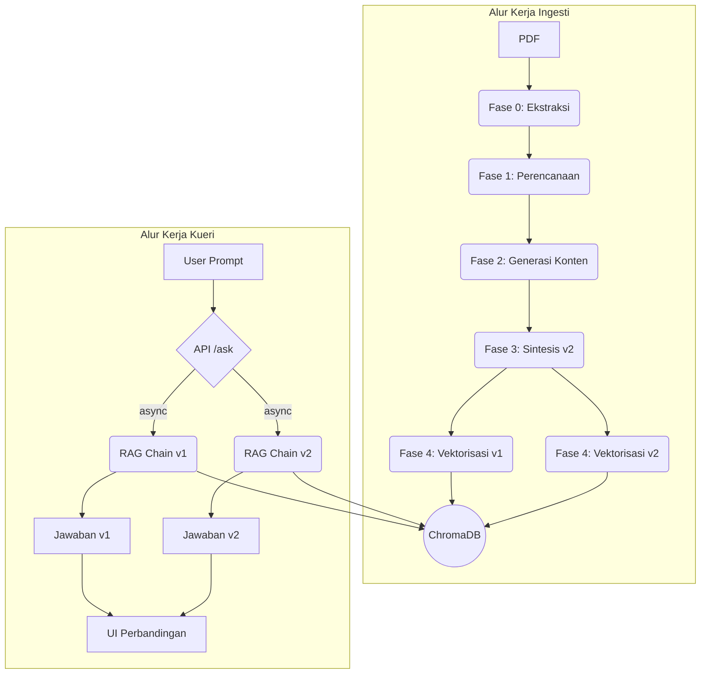

# Genesis-RAG: Advanced RAG with Automated Document Enrichment
Sebuah sistem end-to-end yang mendemonstrasikan pipeline RAG canggih dengan fase enrichment dokumen otomatis untuk memberikan jawaban yang lebih kaya konteks. Proyek ini dibangun dengan arsitektur modular dan praktik terbaik rekayasa perangkat lunak.

## Masalah & Solusi
Sistem RAG standar seringkali gagal menjawab pertanyaan yang membutuhkan pemahaman implisit atau pengetahuan domain yang tidak tertulis secara eksplisit dalam teks. Genesis-RAG mengatasi ini dengan pipeline ingesti multi-tahap yang secara proaktif memperkaya (enrich) dokumen. Hasilnya adalah knowledge base yang superior, memungkinkan jawaban yang lebih akurat dan komprehensif dibandingkan dengan RAG naif.

## Tumpukan Teknologi
| Kategori | Teknologi |
| :--- | :--- |
| Backend | Python, FastAPI |
| Orkestrasi AI | LangChain |
| Model AI | OpenAI (Chat + Embeddings via `langchain-openai`) |
| Database Vektor | ChromaDB (Embedded/Server Mode) |
| Pemrosesan Dokumen | PyMuPDF (`fitz`), Camelot (tabel), Tesseract OCR (gambar) |
| Frontend | Vanilla JavaScript, HTML5, CSS3 |
| Observabilitas | Progress/metrics JSON per fase, Loguru |

## Arsitektur Alur Kerja
Aplikasi ini terdiri dari dua alur kerja utama: Ingesti Dokumen dan Kueri RAG.



## Pengembangan Lokal (Local Development)

### 1. Prasyarat
- Python 3.9+
- Git

### 2. Instalasi
```bash
# 1. Kloning repositori
git clone <URL_REPOSITORI_ANDA>
cd Genesis-RAG

# 2. Buat dan aktifkan virtual environment
python -m venv venv
# Windows:
# .\venv\Scripts\activate
# macOS/Linux:
# source venv/bin/activate

# 3. Instal semua dependensi
pip install -r requirements.txt

# 4. Siapkan environment variables
cp .env_example .env
# Edit file .env dan set OpenAI API Key dan konfigurasi lain (opsional)
```

Contoh `.env` minimal:

```ini
OPENAI_API_KEY=your_openai_api_key_here

# Chroma (default: embedded). Ubah ke "server" bila pakai chroma run
CHROMA_MODE=embedded
CHROMA_DB_PATH=./chroma_db
CHROMA_SERVER_HOST=localhost
CHROMA_SERVER_PORT=8001

# Batas performa (opsional)
PHASE1_TOKEN_BUDGET=35000
PHASE2_TOKEN_BUDGET=50000
PHASE1_CONCURRENCY=7
PHASE1_RPS=3
PHASE2_CONCURRENCY=4
PHASE2_RPS=2
```

### 3. Menjalankan Aplikasi
Ada dua mode penyimpanan vektor Chroma:

- Embedded (default): tidak perlu server terpisah.
- Server: jalankan chroma sebagai service lalu hubungkan dari aplikasi.

Opsi Server:
```bash
# Jalankan bila CHROMA_MODE=server
# Gunakan port berbeda dari app FastAPI (8001 disarankan)
chroma run --path chroma_db --port 8001
```

Jalankan Aplikasi (berlaku untuk kedua mode):
```bash
# Pastikan virtual environment aktif
python -m uvicorn src.main:app --host 127.0.0.1 --port 8000 --reload
```
Server aplikasi sekarang siap; jika CHROMA_MODE=embedded, database tersimpan di `CHROMA_DB_PATH`.

### 4. Buka Aplikasi di Browser
Buka browser dan akses alamat `http://127.0.0.1:8000`.

## Alur Penggunaan UI

1) **Unggah** PDF pada panel kiri untuk menghasilkan `markdown_v1.md` (Fase 0).

2) **Tingkatkan**: Klik "Mulai Enhancement" untuk menjalankan Fase 1 (Perencanaan) dan Fase 2 (Generasi) secara asinkron. UI melakukan polling:
   - `/progress/{document_id}` untuk persen progres gabungan (P0/P1/P2). Lencana status menampilkan "Berjalan... X%".
   - `/get-suggestions/{document_id}` untuk saran parsial hingga final.

3) **Kurasi**: Pada panel Saran, tinjau setiap kartu. Anda dapat:
   - Setujui/Tolak saran.
   - Edit teks saran sebelum finalisasi.
   - Gunakan tombol "Setujui Semua" / "Tolak Semua" sebagai aksi massal.

4) **Finalisasi**: Klik "Finalisasi Dokumen" untuk menyintesis `markdown_v2.md` (Fase 3) dengan teknik penambahan konten yang menjaga konteks (lihat bagian Metode), lalu vektorisasi v1 & v2 ke ChromaDB (Fase 4). Stepper berpindah ke fase Tanya Jawab.

5) **Tanya Jawab**: Ajukan pertanyaan dan bandingkan jawaban dari v1 (asli) dan v2 (diperkaya).

## Konfigurasi
Pengaturan utama (model, mode Chroma, direktori artefak, batas performa) dikelola di `src/core/config.py` dan dapat diubah via environment variables. Lihat bagian `.env` di atas.

Variabel penting:
- `OPENAI_API_KEY`, `LLM_MODEL`, `EMBEDDING_MODEL`
- `CHROMA_MODE` (`embedded`|`server`), `CHROMA_DB_PATH`, `CHROMA_SERVER_HOST`, `CHROMA_SERVER_PORT`
- `PIPELINE_ARTEFACTS_DIR` (default: `artefacts`)
- Batas performa: `PHASE1_TOKEN_BUDGET`, `PHASE2_TOKEN_BUDGET`, `PHASE1_CONCURRENCY`, `PHASE1_RPS`, `PHASE2_CONCURRENCY`, `PHASE2_RPS`

## API Endpoints

### `POST /upload-document/`
Unggah PDF dan jalankan Fase 0 (ekstraksi) saja.

- Request: `multipart/form-data` dengan field `file`
- Response 201 (UploadResponse):
  ```json
  {
    "document_id": "uuid",
    "markdown_content": "...markdown_v1.md..."
  }
  ```

### `POST /start-enhancement/{document_id}`
Menjalankan tugas latar belakang untuk Fase 1 (perencanaan) dan Fase 2 (generasi). Kembalikan segera dan lanjutkan via polling.

- Response 200:
  ```json
  { "message": "Proses peningkatan dimulai", "document_id": "uuid" }
  ```

### `GET /get-suggestions/{document_id}`
Polling daftar saran hasil Fase 2. Jika `suggestions.json` belum tersedia, endpoint otomatis mengembalikan hasil parsial dari `suggestions_partial.json` bila ada.

- Response 200 (EnhancementResponse):
  ```json
  { "document_id": "uuid", "suggestions": [ /* SuggestionItem[] */ ] }
  ```
  Catatan: Selama generasi berlangsung, daftar ini akan bertambah seiring waktu (parsial → final).

### `GET /progress/{document_id}`
Progress gabungan pipeline (ringan untuk UI):
```json
{
  "document_id": "uuid",
  "percent": 0.73,
  "phase0": {"done": true},
  "phase1": {"done": true, "progress": {"preselected": 64, "processed": 64, "llm_calls": 52, "token_budget_used": 18000}},
  "phase2": {"done": false, "progress": {"total_items": 42, "processed": 30, "percent": 0.71}},
  "status": "running"
}
```

### `POST /finalize-document/`
Terima saran terkurasi, sintesis `markdown_v2.md` dan vektorisasi v1 & v2 ke ChromaDB.

- Request (CuratedSuggestions):
  ```json
  {
    "document_id": "uuid",
    "suggestions": [ {"id":"term_0","type":"term_to_define","original_context":"...","generated_content":"...","confidence_score":0.9,"status":"approved"} ]
  }
  ```
- Response 200:
  ```json
  { "message": "Dokumen difinalisasi dan divektorisasi.", "document_id": "uuid" }
  ```

### `POST /ask/`
Ajukan pertanyaan terhadap versi v1, v2, atau keduanya dari dokumen. Parameter tambahan: `trace` (bool) untuk mengembalikan sumber evidence, `k` (int) untuk top-k retrieval.

- Request:
  ```json
  { "document_id": "uuid", "prompt": "Pertanyaan Anda", "version": "both" }
  ```
- Response 200 (jika `version` = `both`):
  ```json
  {
    "unenriched_answer": "jawaban dari v1",
    "enriched_answer": "jawaban dari v2",
    "prompt": "Pertanyaan Anda"
  }
  ```
  Response 200 (jika `version` = `v1` atau `v2`):
  ```json
  { "answer": "jawaban", "version": "v1", "prompt": "Pertanyaan Anda", "sources": [/* opsional bila trace=true */] }
  ```

## Metode & Teknik Per Fase

- __[Fase 0: Ekstraksi & Konversi PDF ke Markdown]__
  
  **Pipeline PDF→Markdown Multi-Modal dengan Klasifikasi Blok Cerdas**
  
  Sistem ekstraksi PDF menggunakan PyMuPDF (`fitz`) dengan algoritma klasifikasi blok tiga tahap yang dapat menangani dokumen dengan teks, tabel, dan gambar secara bersamaan. Pipeline ini dirancang untuk memproses dokumen Indonesia/Inggris dengan robust handling untuk berbagai format PDF.
  
  **Arsitektur Ekstraksi:**
  ```
  PDF Input → [Block Detection] → [Classification] → [Content Extraction] → Markdown Output
       ↓              ↓                  ↓                   ↓
   PyMuPDF      Smart Classifier    Text/Table/Image    Staged Synthesis
                                    Processors
  ```
  
  **1. Deteksi dan Klasifikasi Blok**
  - **Klasifikasi Otomatis**: Setiap blok PDF diklasifikasikan sebagai `paragraph`, `table-candidate`, atau `figure`
  - **Multi-Method Text Extraction**: 
    - Method 1: Standard PyMuPDF (lines → spans → text)
    - Method 2: Direct text field extraction
    - Method 3: Fallback field scanning
  - **Algoritma Klasifikasi Cerdas**:
    - Analisis rasio karakter (digit vs alphabetic vs punctuation)
    - Pattern matching untuk tabel (mata uang, persentase, tanggal)
    - Deteksi konten numerik vs tekstual
    - Generous paragraph classification untuk mengurangi false negatives
  
  **2. Pemrosesan Teks (Text Processing)**
  - **Ekstraksi Span-by-Span**: Menggabungkan spans dengan proper character separation
  - **Deteksi Heading**: Analisis font size, style, dan positioning untuk struktur hierarkis
  - **Text Normalization**: Cleanup whitespace, karakter artifacts, dan formatting issues
  - **Minimum Content Filtering**: Hanya teks ≥10 karakter yang dianggap meaningful paragraph
  
  **3. Ekstraksi Tabel (Table Extraction)**
  - **Camelot Integration**: Library khusus untuk table detection dan parsing
  - **Dual-Mode Processing**:
    - Stream mode: Untuk tabel dengan garis pemisah yang jelas
    - Lattice mode: Untuk tabel dengan border/grid structure
  - **Table Area Detection**: Otomatis mendeteksi region yang mengandung struktur tabular
  - **CSV/Markdown Conversion**: Output tabel dalam format Markdown yang readable
  - **Quality Filtering**: Hanya tabel dengan struktur yang valid yang diproses
  
  **4. Ekstraksi Gambar dan OCR (Image/Figure Processing)**
  - **Multi-Platform OCR Support**:
    - **Tesseract OCR**: Automatic Windows path detection (`C:\Program Files\Tesseract-OCR`)
    - **Multi-Language**: Indonesian + English (`-l ind+eng`)
    - **Multiple OCR Configs**: Fallback configurations untuk optimal text extraction
  - **Image Extraction Pipeline**:
    ```
    PDF Figure Block → Image Extraction → OCR Processing → Text Integration
         ↓                    ↓               ↓               ↓
    Bounding Box        PNG Generation   Tesseract      Markdown Embed
    Detection           (High-res)       Multi-config
    ```
  - **Smart OCR Modes**:
    - `--psm 6`: Uniform text block (default)
    - `--psm 8`: Single word mode (fallback)
    - `--psm 11`: Sparse text mode (final fallback)
  - **OCR Text Cleanup**: Whitespace normalization, artifact removal, quality filtering
  - **Graceful Degradation**: System continues processing even if Tesseract unavailable
  
  **5. Staged Content Synthesis**
  - **Three-Stage Assembly**:
    - Stage 1: Text-first approach (all paragraphs and headings)
    - Stage 2: Table integration with proper spacing
    - Stage 3: Figure integration with OCR text as alt-text
  - **Content Ordering**: Maintains original document flow and page sequence
  - **Metadata Preservation**: Page numbers, bounding boxes, section headers
  - **Quality Assurance**: Fallback to basic text extraction if structured processing fails
  
  **6. Output dan Artefak**
  - **Primary Output**: `markdown_v1.md` - Clean, structured markdown
  - **Text Backup**: `full_text.txt` - Raw text fallback
  - **Image Assets**: `figures/` directory dengan PNG files + web paths
  - **Table Data**: Embedded markdown tables atau CSV references
  - **Metadata**: `segments.json` dengan segment info untuk phase selanjutnya
  - **Processing Metrics**: `phase_0_metrics.json` untuk monitoring dan debugging
  
  **7. Error Handling dan Robustness**
  - **Multi-Level Fallbacks**: Text → Table → Image processing dengan independent failure handling
  - **Block Classification Fallback**: Jika semua blok 'unknown', gunakan basic text extraction
  - **OCR Error Recovery**: Continue processing tanpa OCR jika Tesseract tidak tersedia
  - **Memory Management**: Efficient processing untuk dokumen besar
  - **Progress Tracking**: Real-time progress updates via JSON artifacts
  
  **Supported Document Types:**
  - ✅ Text-heavy documents (reports, articles, papers)
  - ✅ Table-intensive documents (financial reports, data sheets)
  - ✅ Image-heavy documents (presentations, infographics)
  - ✅ Mixed-content documents (comprehensive reports dengan text+table+images)
  - ✅ Indonesian/English bilingual documents
  
  **Technical Requirements:**
  - PyMuPDF (fitz) untuk core PDF processing
  - Camelot untuk advanced table extraction
  - Tesseract OCR untuk image text extraction (optional tapi recommended)
  - PIL/Pillow untuk image processing
  - Robust error handling untuk production use

- __[Fase 1: Perencanaan (Two-stage gating)]__
  - Stage-A: pre-scoring statis + kuota per header untuk memilih kandidat terbaik dari `segments.json`.
  - Stage-B: “skim pass” hemat token dengan LLM menghasilkan item calon (maks 2 per segmen) sesuai skema JSON.
  - Kontrol performa: concurrency (`PHASE1_CONCURRENCY`), rate limit RPS (`PHASE1_RPS`), token budget (`PHASE1_TOKEN_BUDGET`).
  - Caching hasil panggilan LLM (SQLite KV) untuk menghindari biaya berulang.
  - Checkpointing dan metrik: `plan_checkpoint.json`, `phase_1_progress.json`, `phase_1_metrics.json`.
  - Output akhir: `plan.json` (dan `enrichment_plan.json` untuk kompatibilitas).

- __[Fase 2: Generasi Konten (Progresif)]__
  - Konsumsi asinkron per item rencana dengan concurrency & rate limit (`PHASE2_CONCURRENCY`, `PHASE2_RPS`) dan token budget (`PHASE2_TOKEN_BUDGET`).
  - Menulis hasil secara bertahap: `suggestions_partial.json` agar UI dapat menampilkan saran sementara.
  - Progres & metrik ditulis ke `phase_2_progress.json` dan `phase_2_metrics.json` (mis. `processed`, `llm_calls`, `duration_sec`, `p50/p95_latency_sec`, `token_budget_used`, `percent`).
  - Output final: `suggestions.json` dan `generated_content.json`.

- __[Fase 3: Sintesis v2]__
  - Menerapkan saran terkurasi ke `markdown_v1.md` dengan penempatan yang mempertahankan konteks.
  - Teknik penempatan token-aware: untuk sisipan setelah rentang teks, posisi digeser ke batas token terdekat (tiktoken) agar tidak memotong karakter, lalu disisipkan marker/footnote yang stabil.
  - Hasil: `markdown_v2.md`.

- __[Fase 4: Vektorisasi & RAG]__
  - Memecah v1 dan v2 dan menyimpan ke Chroma dengan metadata: `source_document` dan `version` (`v1`/`v2`).
  - Endpoint `/ask/` melakukan retrieval terfilter per versi dan menjalankan chain QA. Opsi `trace` mengembalikan sumber terurut berdasarkan skor relevansi yang telah dinormalisasi.

## Artefak yang Dihasilkan per Dokumen

- `markdown_v1.md`, `full_text.txt`
- `segments.json`
- `phase_0_metrics.json`
- `plan_checkpoint.json` (opsional), `phase_1_progress.json`, `phase_1_metrics.json`, `plan.json`, `enrichment_plan.json`
- `suggestions_partial.json` (selama proses), `phase_2_progress.json`, `phase_2_metrics.json`, `generated_content.json`, `suggestions.json`
- `markdown_v2.md`
- Cache LLM: `cache/local_cache.sqlite` (untuk Phase-1 KV caching)

## Troubleshooting

- **OPENAI_API_KEY tidak diset**: Pastikan `.env` berisi `OPENAI_API_KEY` yang valid.
- **Tidak bisa konek ke ChromaDB (server)**: Pastikan `CHROMA_MODE=server` dan service berjalan di port sesuai `CHROMA_SERVER_PORT` (mis. 8001 jika mengikuti contoh), atau gunakan `embedded`.
- **Progres lambat/polling lama**: Dokumen besar, batas RPS, atau token budget habis. Atur `PHASE*_CONCURRENCY/RPS` dan `PHASE*_TOKEN_BUDGET` sesuai kebutuhan.
- **Saran kosong**: Periksa `phase_1_progress.json`/`phase_2_progress.json` dan log. Sistem menulis hasil parsial bila memungkinkan (`suggestions_partial.json`).