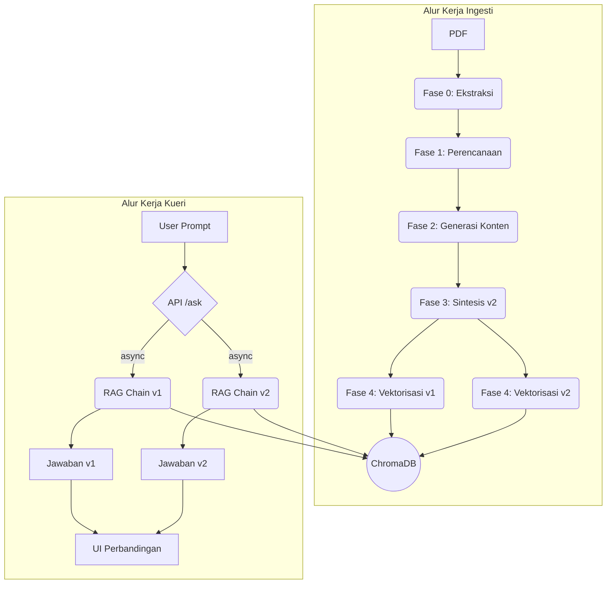

# Genesis-RAG: Advanced RAG with Automated Document Enrichment
Sebuah sistem end-to-end yang mendemonstrasikan pipeline RAG canggih dengan fase enrichment dokumen otomatis untuk memberikan jawaban yang lebih kaya konteks. Proyek ini dibangun dengan arsitektur modular dan praktik terbaik rekayasa perangkat lunak.

## Masalah & Solusi
Sistem RAG standar seringkali gagal menjawab pertanyaan yang membutuhkan pemahaman implisit atau pengetahuan domain yang tidak tertulis secara eksplisit dalam teks. Genesis-RAG mengatasi ini dengan pipeline ingesti multi-tahap yang secara proaktif memperkaya (enrich) dokumen. Hasilnya adalah knowledge base yang superior, memungkinkan jawaban yang lebih akurat dan komprehensif dibandingkan dengan RAG naif.

## Tumpukan Teknologi
| Kategori | Teknologi |
| :--- | :--- |
| Backend | Python, FastAPI |
| Orkestrasi AI | LangChain |
| Model AI | Google Gemini (Embeddings & Generative) |
| Database Vektor | ChromaDB (Client-Server Mode) |
| Pemrosesan Dokumen | PyMuPDF |
| Frontend | Vanilla JavaScript, HTML5, CSS3 |
| Logging | Loguru |

## Arsitektur Alur Kerja
Aplikasi ini terdiri dari dua alur kerja utama: Ingesti Dokumen dan Kueri RAG.



## Pengembangan Lokal (Local Development)

### 1. Prasyarat
- Python 3.9+
- Git

### 2. Instalasi
```bash
# 1. Kloning repositori
git clone <URL_REPOSITORI_ANDA>
cd Genesis-RAG

# 2. Buat dan aktifkan virtual environment
python -m venv venv
# Windows:
# .\venv\Scripts\activate
# macOS/Linux:
# source venv/bin/activate

# 3. Instal semua dependensi
pip install -r requirements.txt

# 4. Siapkan environment variables
cp .env_example .env
# Edit file .env dan masukkan Google API Key Anda
```

### 3. Menjalankan Aplikasi
Proyek ini menggunakan arsitektur Klien-Server. Anda perlu menjalankan dua proses di dua terminal terpisah: Server Database (ChromaDB) dan Server Aplikasi (FastAPI).

**Terminal 1: Jalankan Server ChromaDB**
Terminal ini didedikasikan untuk mengelola database vektor (Cukup jalankan satu kali saja).

```bash
# Dari direktori root proyek, jalankan perintah berikut:
chroma run --path chroma_db --port 8001
```
Biarkan terminal ini tetap berjalan di latar belakang.

**Terminal 2: Jalankan Server Aplikasi FastAPI**
Terminal ini untuk menjalankan logika utama dan API aplikasi.

```bash
# Pastikan virtual environment Anda sudah aktif
# Dari direktori root proyek, jalankan perintah berikut:
uvicorn src.main:app --reload
```
Server aplikasi sekarang akan berjalan dan terhubung ke server ChromaDB.

### 4. Buka Aplikasi di Browser
Buka browser Anda dan akses alamat `http://127.0.0.1:8000`.

## Konfigurasi
Pengaturan utama proyek, seperti nama model, path, dan template prompt, dikelola secara terpusat di `src/core/config.py` untuk kemudahan modifikasi.

## API Endpoints

### `POST /upload-document/`
Mengunggah file PDF dan menjalankan seluruh pipeline ingesti.
- **Request Body**: `multipart/form-data` dengan field `file`.
- **Success Response (201 Created)**:
  ```json
  {
    "message": "Dokumen berhasil diproses.",
    "document_id": "xxxxxxxx-xxxx-xxxx-xxxx-xxxxxxxxxxxx"
  }
  ```

### `POST /ask/`
Mengajukan pertanyaan ke dokumen yang sudah diproses.
- **Request Body**: `application/json`
  ```json
  {
    "document_id": "xxxxxxxx-xxxx-xxxx-xxxx-xxxxxxxxxxxx",
    "prompt": "Apa poin-poin utama dari dokumen ini?"
  }
  ```
- **Success Response (200 OK)**:
  ```json
  {
    "unenriched_answer": "Jawaban dari dokumen asli...",
    "enriched_answer": "Jawaban dari dokumen yang diperkaya...",
    "prompt": "Apa poin-poin utama dari dokumen ini?"
  }
  ```